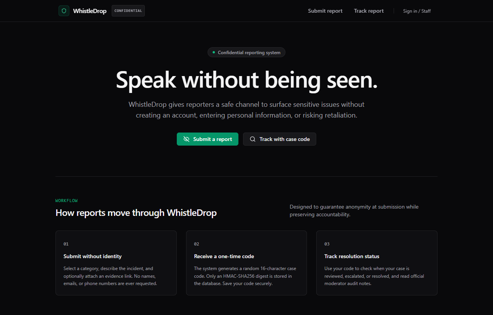
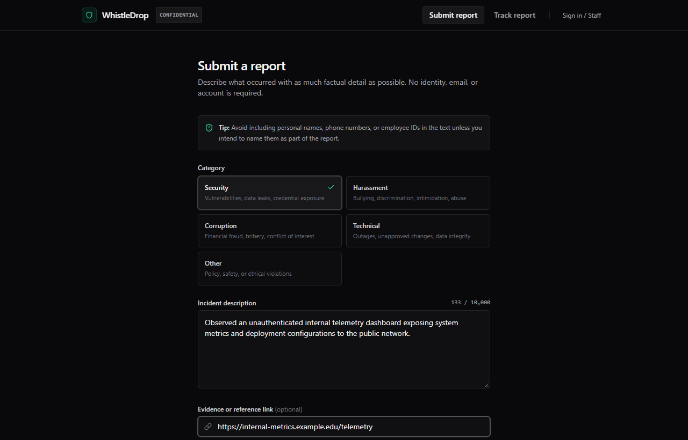
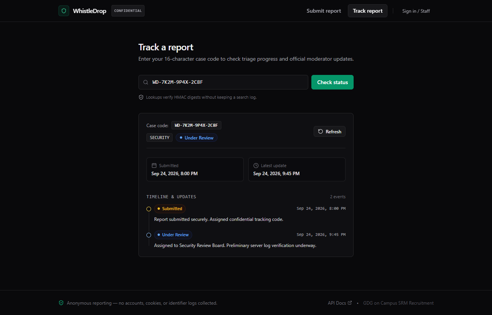
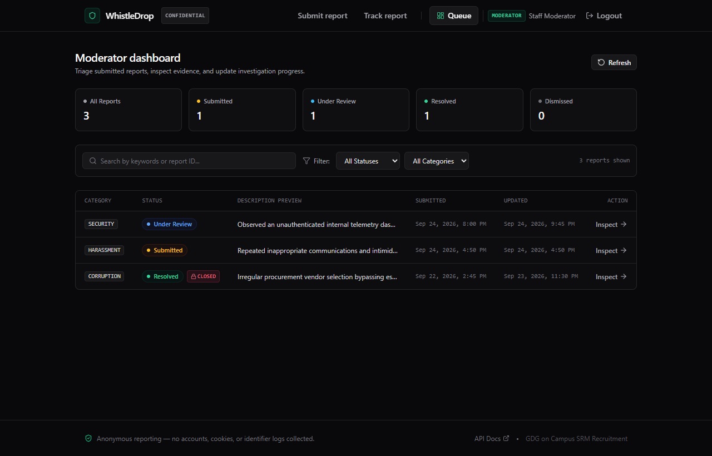
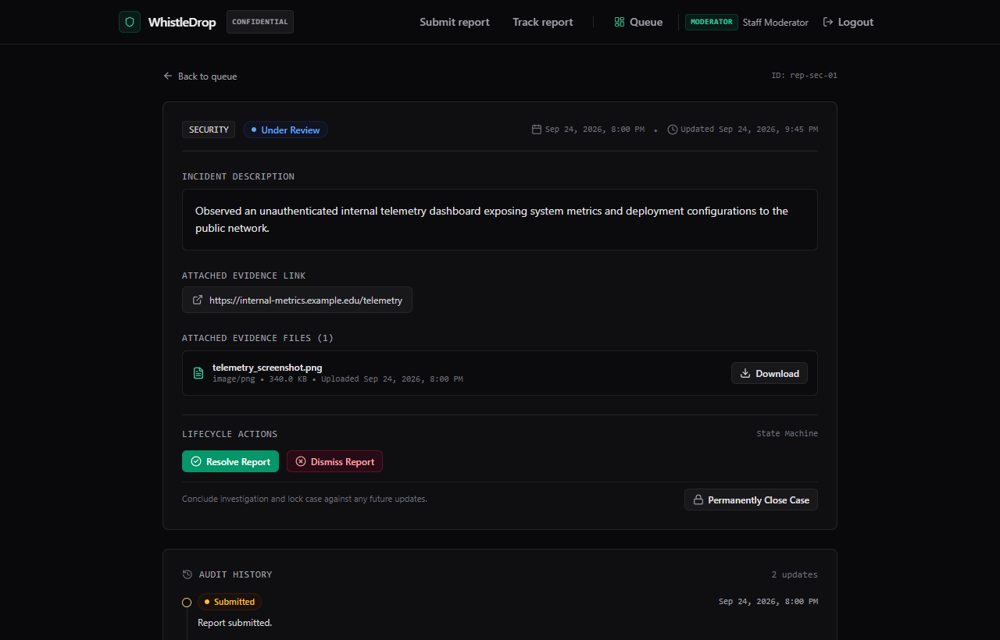
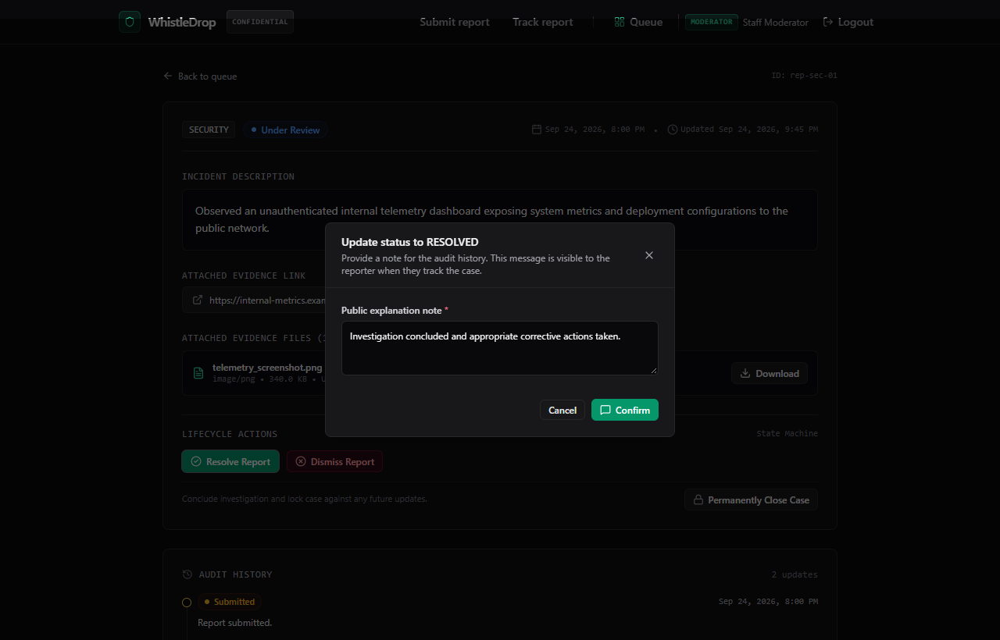

# WhistleDrop — Speak Without Being Seen

WhistleDrop is an anonymous whistleblower reporting system built for the GDG on Campus SRM Technical Domain recruitment. It allows anyone to submit a confidential report without creating an account or providing personal details, receive a private case tracking code, and track the report's review progress over time.

---

## Screenshots

### Landing & Overview
The public landing page introduces the system workflow and provides immediate access to submit or track reports.



### Anonymous Report Submission
Reporters select an incident category, write details, and optionally attach reference links or evidence files without ever creating an account.



### Case Tracking & Timeline
Reporters can check investigation status and read official audit notes at any time using their private 16-character case code.



### Moderator Dashboard
Authenticated staff can view the queue, filter by status or category, search reports, and monitor overview metrics.



### Case Inspection & Lifecycle Actions
Moderators review incident details, access attached evidence, and transition cases through defined workflow stages.



### Status Transitions & Audit Updates
Status changes require an audit note that is recorded in the case timeline and made visible to the reporter.



---

## Live Demo & Staff Access

The platform is deployed and fully accessible:

- **Frontend Application**: [https://whistle-drop-two.vercel.app](https://whistle-drop-two.vercel.app)
- **Backend API & Swagger Docs**: [https://whistledrop.onrender.com/docs](https://whistledrop.onrender.com/docs)
- **Staff / Moderator Login**: [https://whistle-drop-two.vercel.app/moderator/login](https://whistle-drop-two.vercel.app/moderator/login)

To evaluate the staff moderator queue, case review workflow, status transitions, and user management:

| Field | Value |
|---|---|
| **Username** | `admin` |
| **Password** | `Adminsihere` |
| **Role** | `ADMIN` (access to all moderator review tools + admin user role management) |

> **Note**: Anonymous reporters do not need an account. You can submit reports and track cases directly from the public interface.

---

## What it does

1. **Submit a report anonymously**: A user picks a category (Security, Harassment, Corruption, Technical, or Other), types a description, and can optionally provide an evidence URL or upload an evidence file (image, PDF, or text). No name, email, phone number, or login is required.
2. **Receive a case code**: Upon submission, the system generates a private 16-character tracking code formatted like `WD-XXXX-XXXX-XXXX-XXXX`. The user saves this code.
3. **Track progress**: The user enters their case code on the tracking page to view the current status (`SUBMITTED`, `UNDER_REVIEW`, `RESOLVED`, or `DISMISSED`) and read public status updates left by moderators.
4. **Moderator & Admin dashboard**: Staff members can sign in with role-based permissions (`USER`, `MODERATOR`, `ADMIN`). Moderators can search, filter, update statuses with notes, view evidence files via signed links, and close cases. Admins can also manage user roles and promote registered users to moderators.

---

## Features

- **Account-free anonymous reporting**: Submit reports without an account or personal information.
- **Case-code tracking**: Reports are tracked using 16-character Crockford Base32 codes.
- **One-way case code storage**: The database stores an HMAC-SHA256 hash of the case code with a server-side secret key; raw codes are never stored in the database.
- **Strict status workflow**: Status transitions follow an explicit state machine (`SUBMITTED` → `UNDER_REVIEW` → `RESOLVED` or `DISMISSED`), with audit notes appended to each step.
- **Permanent case closure**: Moderators can formally close a case, locking it from further status edits.
- **Evidence file upload**: Users can upload evidence files (PNG, JPG, WEBP, PDF, TXT up to 10 MB). File contents are validated by inspecting magic bytes rather than trusting file extensions.
- **Private evidence storage**: Evidence files are stored in a private Supabase Storage bucket and accessed through short-lived signed URLs for authenticated staff.
- **Role-based access control (RBAC)**: 3-tier hierarchy (`USER`, `MODERATOR`, `ADMIN`). New registrations default to `USER`; administrators can grant or revoke moderator privileges.
- **Admin user management**: Admins can search registered users by name or email, view assigned roles, and promote or demote accounts.
- **Interactive API documentation**: Automatically generated Swagger UI at `/docs` and ReDoc at `/redoc`.
- **Comprehensive test suite**: 81 automated backend unit and integration tests.
- **Production deployment**: Configured and deployed across Vercel (Frontend), Render (Backend), and Supabase (PostgreSQL database and private Storage).

---

## How it works

### Anonymous Submission & Privacy
When a report is submitted via `POST /api/v1/reports`, the backend only takes the report category, description, and optional evidence. The application does not intentionally store reporter IP addresses, User-Agent headers, browser fingerprints, or reporter account IDs.

### Case Code Generation & Storage
- **Code format**: Codes use 16 Crockford Base32 characters (`23456789ABCDEFGHJKMNPQRSTUVWXYZ`), grouped into 4 blocks of 4 characters (`WD-XXXX-XXXX-XXXX-XXXX`). Crockford Base32 excludes visually confusing characters like `0`, `O`, `1`, `I`, and `L`.
- **Entropy**: $32^{16} = 2^{80} \approx 1.2 \times 10^{24}$ possible combinations (~80 bits of entropy), generated using Python's `secrets` module (CSPRNG).
- **Storage**: The plaintext code is returned to the user once upon submission and is never stored in the database. Instead, the backend hashes the normalized code using **HMAC-SHA256** with a server-side secret (`CASE_CODE_SALT`). When tracking a report, the input code is hashed with the same key to look up the record.

### Status Lifecycle
Reports follow an explicit state machine:
- Initial state: `SUBMITTED`
- Review state: `UNDER_REVIEW`
- Final states: `RESOLVED` or `DISMISSED`

Invalid transitions (such as jumping directly from `SUBMITTED` to `RESOLVED`, or modifying a report after it has been marked closed) are rejected by the backend with HTTP 400. Each valid status update creates a timestamped record in `status_updates` with an explanatory message visible on the tracking timeline.

### Evidence Handling
Evidence files can be uploaded as multipart form data alongside the report:
- The backend reads the raw bytes and checks file magic numbers (file signatures) to confirm the true MIME type.
- Executable files (`.exe`, `.sh`, `.bat`, `.php`, `.js`) are strictly rejected.
- Valid files are uploaded to a private Supabase Storage bucket using an unpredictable storage path (`reports/{report_id}/evidence/{uuid}_{filename}`).
- When a moderator views evidence, the backend generates an authenticated signed URL with a 5-minute expiration time.

### Role Hierarchy & Permissions
- **Anonymous**: Can submit reports and look up status by case code.
- **`USER`**: Registered user. Can submit and track reports; blocked from moderator and admin endpoints.
- **`MODERATOR`**: Can view the report queue, search and filter cases, view evidence files, update report statuses, and close cases.
- **`ADMIN`**: Inherits all moderator permissions plus user management (listing users, searching accounts, and granting/revoking the `MODERATOR` role). The primary admin account is protected from accidental demotion.

---

## Tech Stack

| Layer | Technology | Purpose |
|---|---|---|
| **Frontend** | React 18, TypeScript, Vite | Single-page application with responsive UI |
| **Styling & Icons** | Tailwind CSS, Lucide React | Clean, responsive interface styling |
| **Backend** | Python 3.12+, FastAPI, Uvicorn | Asynchronous REST API service |
| **Data Validation** | Pydantic v2 | Request/response schemas and input sanitization |
| **ORM & Migrations** | SQLAlchemy 2.0, Alembic | Database models, migrations, and PostgreSQL driver |
| **Database** | PostgreSQL (Supabase) | Production relational database |
| **Object Storage** | Supabase Storage | Private bucket for evidence file uploads |
| **Authentication** | bcrypt (12 rounds), PyJWT | Password hashing and JWT bearer tokens |
| **Deployment** | Vercel, Render | Frontend SPA on Vercel, backend API on Render |
| **Testing** | pytest, httpx TestClient | 81 automated tests |

---

## Architecture

```
                    ┌─────────────────────────┐
                    │      Vercel Frontend    │
                    │   (React + TypeScript)  │
                    └────────────┬────────────┘
                                 │ HTTPS / CORS
                                 ▼
                    ┌─────────────────────────┐
                    │      Render Backend     │
                    │    (FastAPI + Uvicorn)  │
                    └──────┬────────────┬─────┘
                           │            │
             PostgreSQL    │            │  HTTPS REST
        (Session Pooler)   │            │  (Signed URLs)
                           ▼            ▼
               ┌───────────────┐   ┌─────────────────────────┐
               │   Supabase    │   │     Supabase Storage    │
               │  PostgreSQL   │   │  (whistledrop-evidence) │
               └───────────────┘   └─────────────────────────┘
```

---

## API Overview

The backend exposes 16 endpoints structured under `/api/v1`:

### Public Endpoints
- `POST /api/v1/reports` — Submit an anonymous report (JSON or multipart with file upload)
- `GET /api/v1/reports/{case_code}` — Look up report status and updates timeline by case code
- `POST /api/v1/auth/register` — Register a new account (assigned `USER` role)
- `POST /api/v1/auth/login` — Sign in and receive a JWT bearer token
- `GET /health` — Health check endpoint for uptime monitoring

### Authenticated User Endpoints
- `GET /api/v1/auth/me` — Get current user profile and active role

### Moderator Endpoints (Requires `MODERATOR` or `ADMIN` role)
- `GET /api/v1/moderator/reports` — List reports with status, category, search, and pagination filters
- `GET /api/v1/moderator/reports/{id}` — Get full report detail, internal timeline, and evidence links
- `PATCH /api/v1/moderator/reports/{id}/status` — Update report status with an audit message
- `POST /api/v1/moderator/reports/{id}/close` — Permanently close a case
- `GET /api/v1/moderator/evidence/{evidence_id}/signed-url` — Generate a temporary signed download URL for evidence

### Administrator Endpoints (Requires `ADMIN` role)
- `GET /api/v1/admin/users` — List registered users with search and role filters
- `PATCH /api/v1/admin/users/{user_id}/role` — Grant or revoke moderator role
- `POST /api/v1/admin/recovery/reset-password` — Emergency password reset endpoint (active only when `ADMIN_RECOVERY_SECRET` is set)

Interactive documentation is available at `/docs` (Swagger UI) and `/redoc` (ReDoc).

---

## Project Structure

```
WhistleDrop/
├── backend/
│   ├── alembic/                 # Database schema migrations
│   │   └── versions/            # 0001_initial, 0002_evidence, 0003_user_roles_and_case_closure
│   ├── app/
│   │   ├── api/                 # API routes and dependencies
│   │   │   ├── deps.py          # DB session and role-based auth dependencies
│   │   │   └── v1/endpoints/    # reports.py, auth.py, moderator.py, admin.py
│   │   ├── core/                # Configuration and security
│   │   │   ├── config.py        # Settings and environment validation
│   │   │   └── security.py      # Password hashing (bcrypt) and JWT helpers
│   │   ├── db/                  # Database engine and session setup
│   │   ├── models/              # SQLAlchemy models: Report, Moderator, StatusUpdate, EvidenceFile
│   │   ├── schemas/             # Pydantic models for validation and serialization
│   │   ├── services/            # Business logic: report_service, auth_service, storage_service
│   │   └── utils/               # Case code generation, HMAC hashing, file validation
│   ├── scripts/
│   │   └── create_initial_admin.py  # CLI script to provision the primary admin account
│   ├── tests/                   # 81 automated test cases
│   ├── requirements.txt         # Python dependencies
│   └── .env.example             # Backend environment template
├── frontend/
│   ├── src/
│   │   ├── components/common/   # Reusable UI components (Navbar, Modal, Badge, etc.)
│   │   ├── context/             # AuthContext for session management
│   │   ├── pages/               # HomePage, SubmitReportPage, TrackReportPage, ModeratorPages, etc.
│   │   ├── services/            # Typed API client with unified error extraction
│   │   └── types/               # TypeScript type definitions
│   ├── package.json             # Frontend dependencies
│   └── .env.example             # Frontend environment template
├── render.yaml                  # Render deployment configuration
├── .gitignore                   # Ignored files (.env, venv, node_modules, etc.)
└── README.md                    # Main project documentation
```

---

## Local Setup

### Prerequisites
- Python 3.12+
- Node.js 18+ and npm
- Git

### 1. Clone the repository
```bash
git clone https://github.com/hemant-raghav-kr/WhistleDrop.git
cd WhistleDrop
```

### 2. Backend setup
```bash
# Create and activate virtual environment
python -m venv .venv

# Windows:
.venv\Scripts\activate
# macOS/Linux:
source .venv/bin/activate

# Install dependencies
pip install -r backend/requirements.txt

# Configure environment variables
cd backend
cp .env.example .env

# Apply database migrations
python -m alembic upgrade head

# (Optional) Provision the initial admin account
python scripts/create_initial_admin.py --username admin --email admin@whistledrop.org --password Adminsihere

# Start the development server
uvicorn app.main:app --reload --port 8000
```
The API will run at `http://localhost:8000`. Interactive documentation is at `http://localhost:8000/docs`.

### 3. Frontend setup
In a separate terminal:
```bash
cd frontend

# Install dependencies
npm install

# Configure environment
cp .env.example .env

# Start the Vite development server
npm run dev
```
The web application will open at `http://localhost:5173`.

---

## Environment Variables

### Backend (`backend/.env` / Render Dashboard)

| Variable Name | Description | Required in Production |
|---|---|:---:|
| `ENVIRONMENT` | Environment mode (`development` or `production`). In production, triggers strict security checks. | Yes |
| `DATABASE_URL` | PostgreSQL connection string. In production, use the Supabase Session Pooler (port 5432). | Yes |
| `CASE_CODE_SALT` | Secret key used for HMAC-SHA256 case code hashing. | Yes |
| `JWT_SECRET` | Secret key used to sign and verify JWT authentication tokens. | Yes |
| `FRONTEND_URL` | Production frontend URL (e.g. `https://whistle-drop-two.vercel.app`) for CORS. | Yes |
| `SUPABASE_URL` | Supabase project URL (`https://<project-ref>.supabase.co`). | Yes |
| `SUPABASE_SECRET_KEY` | Supabase API secret key for backend storage access. (`SUPABASE_SERVICE_ROLE_KEY` also supported). | Yes |
| `SUPABASE_STORAGE_BUCKET` | Name of the private storage bucket (`whistledrop-evidence`). | No (default set) |
| `ADMIN_RECOVERY_SECRET` | Temporary secret to enable emergency admin provisioning via API without shell access. | Optional |
| `ACCESS_TOKEN_EXPIRE_MINUTES` | Token expiration time in minutes (default `480` for 8 hours). | No |
| `JWT_ALGORITHM` | JWT signing algorithm (default `HS256`). | No |

### Frontend (`frontend/.env` / Vercel Dashboard)

| Variable Name | Description |
|---|---|
| `VITE_API_URL` | Backend API base URL (`/api/v1` locally, `https://whistledrop.onrender.com/api/v1` in production). |

---

## Testing

The project includes **81 automated tests** covering report creation, privacy protections, case code generation and hashing, file upload and magic byte inspection, status transitions, RBAC permissions, and admin recovery.

Run the test suite from the repository root:
```bash
pytest backend/tests/ -v
```

All 81 tests execute against an isolated in-memory test database with transaction rollbacks after each test.

---

## Deployment

The project is deployed on public cloud infrastructure:

- **Frontend**: Hosted on [Vercel](https://vercel.com) at [https://whistle-drop-two.vercel.app](https://whistle-drop-two.vercel.app). Built with Vite and configured with client-side SPA routing (`vercel.json`).
- **Backend**: Hosted on [Render](https://render.com) as a Web Service at [https://whistledrop.onrender.com](https://whistledrop.onrender.com). Configured with automatic deployments on push to `main` via `render.yaml`.
  - Build command: `pip install -r requirements.txt && python -m alembic upgrade head`
  - Start command: `uvicorn app.main:app --host 0.0.0.0 --port $PORT`
- **Database & Storage**: Hosted on [Supabase](https://supabase.com). Uses PostgreSQL via Supabase's IPv4 connection pooler and a private Supabase Storage bucket for evidence attachments.
- **Evaluation Account**: Seeded with administrator credentials (username `admin`, password `Adminsihere`) accessible via [/moderator/login](https://whistle-drop-two.vercel.app/moderator/login).

---

## Project Status

The WhistleDrop platform is fully deployed and functional across both frontend and backend. Anonymous reports can be submitted and tracked, and staff members can log in to review and manage cases.

---

## License & Attribution

Built for the **GDG on Campus SRM 2026-27 Technical Domain Recruitment**.